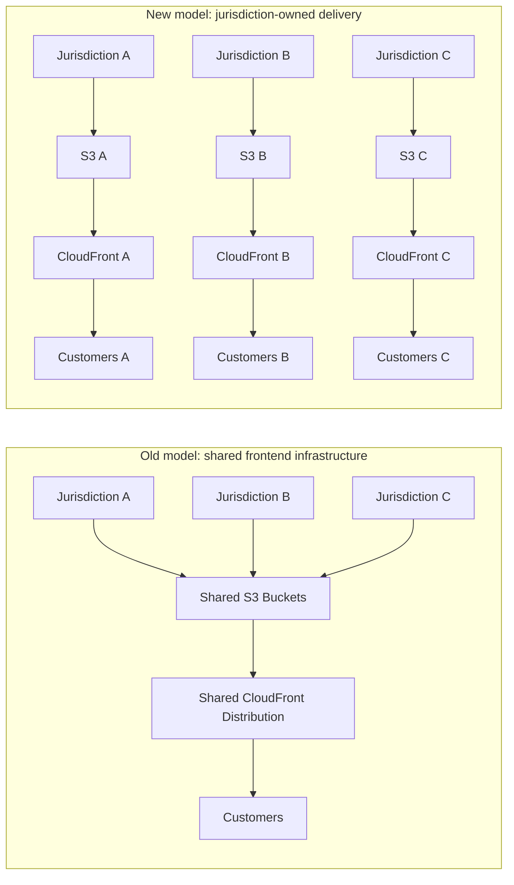
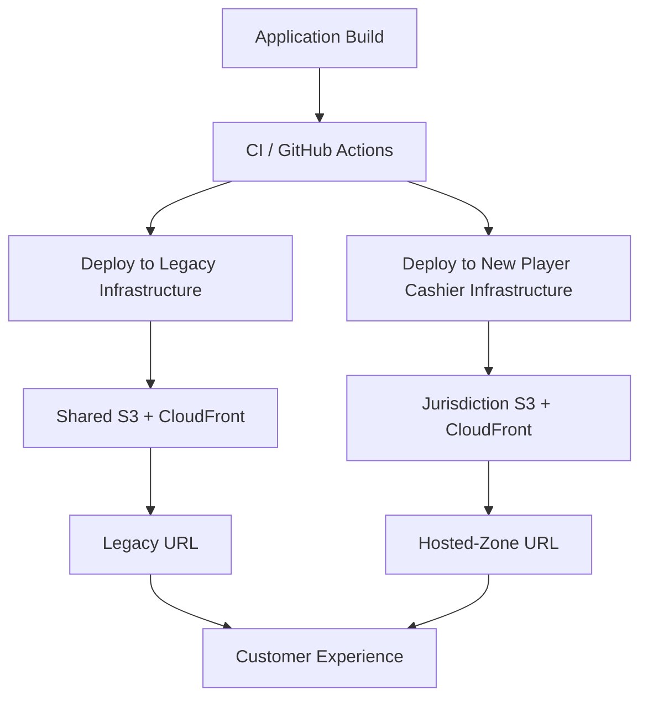
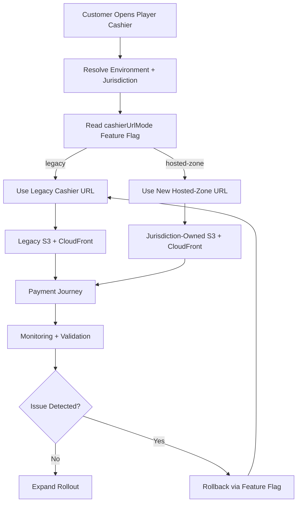

The most successful infrastructure migration is usually the one nobody notices.

There is no new button, no redesign, no visible product feature, and no customer-facing announcement that makes people say, “nice, the infrastructure is better now.” There is only a quiet change underneath the surface of the product. A change that, if it goes well, disappears completely into the customer experience. A change that, if it goes wrong, can block the one journey the whole system exists to support.

In our case, that journey was payments.

The Player Cashier is the frontend experience responsible for money moving in and out of the product. It runs across web desktop, mobile web, Android, and iOS through an embedded iframe, which means the same experience has to behave correctly inside browsers, native webviews, different domains, different jurisdictions, and different operational realities.

When this experience works, nobody thinks about the infrastructure behind it. Customers deposit, withdraw, authenticate, confirm, and continue with their journey. But when it fails, everybody notices very quickly. That is the reality of payment systems. A broken payment flow is not just a broken screen. It can affect revenue, customer trust, support teams, commercial teams, and incident response.

That is why this migration was never only about AWS. It was never only about S3, CloudFront, Terraform, Route 53 hosted zones, or feature flags.

Those were the tools.

The real story was about creating better boundaries around a critical frontend system without asking customers to pay the price of our architectural evolution.

## The architecture that got us here

The old architecture was not wrong.

That is important to say, because after a migration is finished it is very easy to look back at the previous system and describe it as if it was obviously broken. Most of the time, that is not true. The previous architecture usually made sense for the company, the team, and the scale that existed when it was created.

Our frontend infrastructure had grown around a shared delivery model. The application was generated as static assets, uploaded to S3, and distributed through CloudFront.

```txt
Build -> S3 Bucket -> CloudFront -> Customer
```

For a static frontend application, this is a very reasonable model. It is simple, fast, cost-effective, and it lets you serve assets close to the customer without introducing a complex runtime layer. For a long time, it did exactly what we needed.

The complexity did not come from S3. The complexity did not come from CloudFront.

The complexity came from growth.

As the product expanded across more jurisdictions, the same shared infrastructure started carrying more responsibility. More markets. More configuration. More routing rules. More security policies. More assumptions. More people involved. More ways for a change in one place to affect something that was never meant to be touched.

What was once simple started becoming harder to reason about.

And once a payment experience becomes harder to reason about, you have a problem.

## Shared infrastructure creates shared risk

The Player Cashier resolves a lot of its behaviour from the customer context. The URL matters. The environment matters. The jurisdiction matters. The runtime configuration matters.

That model gave us flexibility, but it also created coupling.

Several jurisdictions could depend on the same shared infrastructure resources: shared S3 buckets, shared CloudFront distributions, shared routing assumptions, shared security policies, shared operational ownership, shared access patterns, and shared billing visibility.

On paper, this can look efficient. Fewer resources, less duplication, one place to manage everything.

But infrastructure efficiency is not only about reducing the number of resources you have. It is also about reducing the amount of risk each resource carries.

That is where the old model started showing its limits. If a shared CloudFront distribution is misconfigured, the impact is not necessarily limited to one jurisdiction. If a Content Security Policy change is wrong, it can affect more than the market it was intended for. If a certificate renewal process depends on manual ownership and something is missed, the customer impact can become very real very quickly.

The biggest risk was not AWS going down.

The biggest risk was us.

A wrong configuration. A manual change. An assumption nobody remembered. A security policy that had accumulated over time. A production access surface that was wider than it needed to be.

That is the uncomfortable part of infrastructure work. Many of the most dangerous failures are not dramatic. They are boring. They live in the places where ownership is unclear, where historical configuration has accumulated, and where manual operations still exist because “that is how it has always worked.”

## The real reason we changed

We did not start this migration because we wanted to use Terraform. We did not do it because creating new AWS accounts sounded exciting. We did not do it because “platform engineering” is a nice phrase to put in a presentation.

We did it because the existing model was optimising for a reality that had changed.

The original architecture optimised for shared delivery. The new reality needed owned delivery.

Security, auditability, and ownership became the real drivers.

We wanted infrastructure changes to be reviewable. We wanted fewer people to need direct AWS access. We wanted to reduce manual setup. We wanted a clearer audit trail. We wanted better cost attribution. We wanted to reduce the blast radius of unrelated frontend changes. We wanted every jurisdiction to become easier to support, evolve, and reason about.

Most importantly, we wanted the infrastructure behind the Player Cashier to reflect the criticality of the experience it was serving.

Payments are not just another page. At the scale we operate, even a small infrastructure mistake can become expensive very quickly. So the question was not simply, “how do we move some resources into a new AWS setup?”

The real question was:

How do we move from shared frontend infrastructure to owned, auditable, jurisdiction-aware delivery without creating customer impact?

That question shaped the whole migration.

## The new unit of delivery: a jurisdiction

The biggest architectural shift was deciding that the new unit of delivery should be the jurisdiction.

That sounds simple, but it changes the way you think about the whole system. Instead of treating the Player Cashier as one shared infrastructure estate with accumulated configuration, each jurisdiction would follow a repeatable infrastructure pattern.

Each jurisdiction could have its own dedicated S3 bucket, its own CloudFront distribution, its own Terraform configuration, its own CSP, its own routing boundary, its own monitoring view, and a clearer ownership model.

The new shape looked closer to this:

```txt
Jurisdiction A -> S3 A -> CloudFront A -> Customer A
Jurisdiction B -> S3 B -> CloudFront B -> Customer B
Jurisdiction C -> S3 C -> CloudFront C -> Customer C
```



_The migration was not about creating more infrastructure for the sake of it. It was about moving from shared risk to jurisdiction-owned delivery boundaries._

Yes, this creates more resources. But more resources are not automatically a problem.

In our case, the meaningful cost was driven mostly by usage, not by the mere existence of another S3 bucket or CloudFront distribution. The extra infrastructure was a deliberate trade-off: a little more infrastructure surface in exchange for a lot less operational coupling.

That is a trade-off I would make again.

Because at scale, the cheapest architecture is not always the one with the fewest resources. Sometimes the cheapest architecture is the one that fails in the smallest possible way.

## Terraform was not the story. Reviewability was.

The first practical step was reducing manual effort.

Manual infrastructure changes are risky because they are hard to review, hard to reproduce, and easy to forget. They also create organisational dependency: the person who knows where to click, the person who remembers the old setup, the person who knows which historical configuration should not be touched.

That does not scale.

So we introduced Terraform as the foundation of the new model. Terraform allowed us to describe the infrastructure as code. Buckets, CloudFront distributions, permissions, routing, policies, and environment-specific resources could be defined, reviewed, versioned, and applied consistently.

That changed the nature of the work. Infrastructure was no longer something hidden inside AWS. It became part of the engineering workflow: pull requests, code reviews, version history, repeatable modules, known templates, and consistent patterns.

This mattered because the goal was not to create one new environment manually. The goal was to create a pattern. If we could create one jurisdiction reliably, we needed to be able to create the next one with the same level of confidence.

That is the value of deterministic infrastructure. Not because it removes all complexity, but because it makes complexity visible, reviewable, and repeatable.

## Dedicated AWS accounts

The next boundary was the AWS account itself.

The old model lived in a broader shared frontend AWS ecosystem. That meant more people had administrative access for different reasons, across different parts of the platform. For a critical payment experience, that was not the ownership model we wanted.

So we created dedicated AWS accounts for the Player Cashier: one account for non-production environments and one account for production environments.

This gave us a cleaner separation between validation and live customer traffic. It also reduced the number of people who needed direct access to production infrastructure.

That is not about distrust. It is about reducing the attack surface.

Every additional admin account is another possible path for accidental change, credential compromise, or unclear ownership. The more critical the system, the more intentional access needs to become.

Dedicated accounts also made billing and responsibility easier to understand. The Player Cashier infrastructure was no longer hidden inside a wider shared account. It had a clearer home, clearer ownership, and clearer operational boundaries.

That sounds simple, but it is not.

Clear ownership is one of the hardest things to retrofit into a growing system.

## Hosted zones and the right kind of ownership

The DNS layer was another important part of the migration.

Before the change, the Player Cashier lived under a broader website domain structure. That worked, but it also meant the payment experience was still coupled to the wider web ecosystem.

The new model introduced delegated hosted zones for cashier-owned domains. The purpose was not to own everything. The purpose was to own the right thing.

Production cashier domains could live inside the production cashier account. Non-production cashier domains could live inside the non-production cashier account. Jurisdiction-specific routing could be managed inside the cashier boundary, while the broader website domain could continue to be owned elsewhere.

That distinction matters. Good architecture is not always about centralising ownership. Sometimes it is about delegating ownership to the place where responsibility actually lives.

The Player Cashier team did not need to own the entire website domain ecosystem. But it did need to own the delivery boundary for a critical payment journey.

## Creating resources was the easy part

Creating the infrastructure was not the hardest part.

Moving a critical payment path safely was the hard part.

By the time the new infrastructure existed, we still had several challenges. The old and new architectures needed to stay in sync during the transition. Legacy URLs needed to keep working while the new path was being proven. Consumers needed explicit support for hosted-zone URLs. Environment detection had to avoid non-production falling through to production. CSP had to be correct per jurisdiction and environment. Web, iOS, and Android validation had to be coordinated. The rollout needed to be reversible. Monitoring needed to give confidence without giving everyone direct AWS console access.

This is where migrations often become risky. Not because the target architecture is wrong, but because the transition path is underdesigned.

A good migration is not only about where you want to end up. It is about how safely you can move while the business keeps running.

## Keeping the old and new worlds in sync

The safest migration path was not a big bang.

We needed the old and new infrastructure to coexist. The legacy infrastructure would continue serving customers. The new infrastructure would receive the same assets and stay ready. Both worlds needed to remain in sync while we proved the new path.

Because we already operate with continuous deployment, this was especially important. Developers continue shipping changes. The application continues evolving. The migration cannot ask the whole organisation to stop while infrastructure catches up.

So we extended our CI pipeline to deploy to both infrastructures.

```txt
Application Build
  -> Deploy to legacy infrastructure
  -> Deploy to new jurisdiction-owned infrastructure
```



_The safest migration path was not replacing the old world immediately. It was keeping both worlds in sync until the new one had proven it could behave exactly like the old one._

The same application assets were published to the old path and the new path. This gave us a safety net because the new infrastructure could be validated using real builds, real deployment flows, and real production-like behaviour before customers depended on it.

That was the principle:

Do not replace the old world until the new world has proven it can behave exactly like it.

## Feature flags as the migration control plane

Keeping the assets in sync was only half of the problem. We also needed a way to decide which infrastructure a customer should use.

That decision had to be dynamic, reversible, and safe per environment and jurisdiction. So we introduced a configuration mode that allowed the Player Cashier to decide between the legacy path and the new hosted-zone path.

```ts
cashierUrlMode = 'legacy' | 'hosted-zone'
```

The legacy mode pointed to the existing infrastructure. The hosted-zone mode pointed to the new infrastructure. This was connected to feature flags, which allowed us to control traffic without redeploying the application.

That changed the risk profile completely.

If we wanted to enable one jurisdiction, we could do it deliberately. If we saw something unexpected, we could roll back. No emergency deployment. No rushed release. No big bang cutover. Just a controlled switch.



_Feature flags turned the migration from a one-way release into a controlled operational switch. That reversibility changed the risk profile of the whole rollout._

This is one of the most important lessons of the migration: feature flags are not only for product experiments. Used carefully, they can become a migration control plane.

## Testing the boundary, not just the UI

Frontend testing at scale cannot only be about components.

Components matter, of course. But many of the failures that hurt customers happen at the boundaries: URLs, initialisation, runtime configuration, APIs, origins, CSP, WebViews, CDN behaviour, authentication, and environment detection.

For this migration, the URL was a critical boundary. The Player Cashier needed to behave the same whether it was loaded from the legacy infrastructure or from the new hosted zone.

So before moving customer traffic, we validated the new path across environments. QA helped verify the critical journeys. Each jurisdiction needed to be checked. The same application version needed to work through both delivery paths.

The goal was not just to prove that the new infrastructure existed. The goal was to prove that customers could not tell the difference.

That is a much higher bar.

And it is the right one.

## Running in production before sending traffic

One of the best decisions we made was allowing the new infrastructure to exist in production before it served customer traffic.

The new infrastructure was deployed, kept in sync, and validated, but customers were still using the legacy path. This gave us time to discover the kind of issues that only appear when a system touches real production boundaries.

For example, we found backend assumptions around allowed origins. That was not really a bug. It was a security control doing its job. The backend expected requests to come from known origins. Once the hosted-zone URLs existed, those origins needed to be explicitly supported.

That meant the migration crossed more boundaries than the frontend. We needed to make sure that the new hosted-zone path worked with Server-Sent Events, push notifications, money-in journeys, money-out journeys, origin validation, CSP rules, and both web and native consumers.

This is where the project stopped being “frontend infrastructure” in the narrow sense.

It became a system migration.

Frontend. Infrastructure. Backend. Security. QA. Commercial validation. Monitoring.

All of them touched the boundary.

That is what happens when frontend becomes critical infrastructure.

## The runbook was part of the architecture

Before rollout, we created a runbook.

This was not bureaucracy. It was risk management.

The runbook made the change explicit. Why are we doing this? What exactly is changing? Which jurisdictions are affected? What are the risks? What are the mitigations? How do we validate before rollout? How do we validate after rollout? Who needs to be involved? What dashboards do we watch? What is the rollback path?

When a change can affect a payment journey, stakeholders need more than confidence from the engineering team. They need a plan they can inspect. They need to understand the risk. They need to understand the mitigation. They need to know what happens if something does not behave as expected.

A good runbook does not slow the team down. It helps the team move without relying on heroics.

## Rollout: start small, learn, expand

The rollout was incremental.

We started with web. We started with lower-risk jurisdictions. We validated. We observed. We expanded. Then we moved towards larger markets.

The pattern looked like this:

```txt
Prepare -> Sync -> Validate -> Enable Small -> Observe -> Expand -> Complete
```

At every stage, the feature flag gave us a rollback path. That matters because a migration without rollback is a bet. A migration with rollback is a controlled change.

Those two things feel very different when the system handles payments.

The native work continued in parallel because iOS and Android needed support for the new hosted-zone URLs inside their webviews. That meant web rollout could move ahead while native validation continued on its own path.

This is another important part of real migrations: not every consumer moves at the same speed. The architecture has to allow that.

Backwards compatibility was not an optional detail. It was the safety net.

## Observability without opening the console to everyone

Another important part of the new model was observability.

If fewer people have direct AWS access, the system still needs to be visible. You cannot reduce access by making the system harder to support.

So we relied on dashboards and monitoring instead of asking everyone to open the AWS console. CloudFront health could be observed centrally. Payment behaviour could be checked through business reporting. Errors could be monitored through frontend observability tools. Queries could be tailored when needed to validate specific rollout scenarios.

This is the balance you want.

Less direct production access.

More operational visibility.

Security should not make teams blind. It should make the right information available through safer paths.

## The outcome

The new infrastructure moved the Player Cashier from shared AWS infrastructure to owned, auditable, jurisdiction-aware delivery. The result was not just a different AWS setup. It was a stronger operating model.

We gained clearer ownership, better auditability, fewer manual AWS changes, smaller operational blast radius, better cost attribution, dedicated production and non-production boundaries, jurisdiction-specific CSP, better support for jurisdiction-specific evolution, safer access patterns, a repeatable infrastructure template, and better observability without broad AWS console access.

At the time of the rollout, the new CDN infrastructure was already handling hundreds of requests per second and growing.

Most importantly, the migration completed with zero production incidents.

That is the part that matters.

Customers do not care that you migrated your infrastructure.

They care that they never noticed you did.

## What this taught me as a frontend engineer

This project reinforced something I have felt more and more as my career has progressed.

Frontend engineering at scale does not stop at the browser.

The UI still matters. The customer journey still matters. The code still matters. But the responsibility becomes wider.

You need to understand where your application is hosted, how it is deployed, how it is cached, how it is secured, how it fails, who owns it, who can change it, who pays for it, and who gets paged when something breaks.

That is the difference between delivering features and owning a system.

In this migration, the most important decisions were not only technical decisions. They were boundary decisions. Where should ownership live? Where should access be reduced? Where should cost be attributed? Where should failure be isolated? Where should traffic be controlled? Where should rollback happen?

Those are the questions that make architecture real.

## Final thought

The old architecture was not a failure.

It was a stage.

It helped us reach a certain point. But once the organisation, the product, and the operational reality changed, the architecture had to change with it.

That is something we sometimes forget. Architecture is not something you design once and then preserve forever. It has to keep reflecting the reality of the business.

When the reality changes and the architecture does not, complexity starts leaking everywhere.

In our case, the answer was not simply Terraform. It was not simply new AWS accounts. It was not simply CloudFront, S3, hosted zones, or feature flags.

Those were implementation details.

The real answer was boundaries.

Boundaries for ownership, security, cost, failure, and change.

Because at scale, reliability is not only about making sure things work. It is about making sure that when things change, they change safely.
