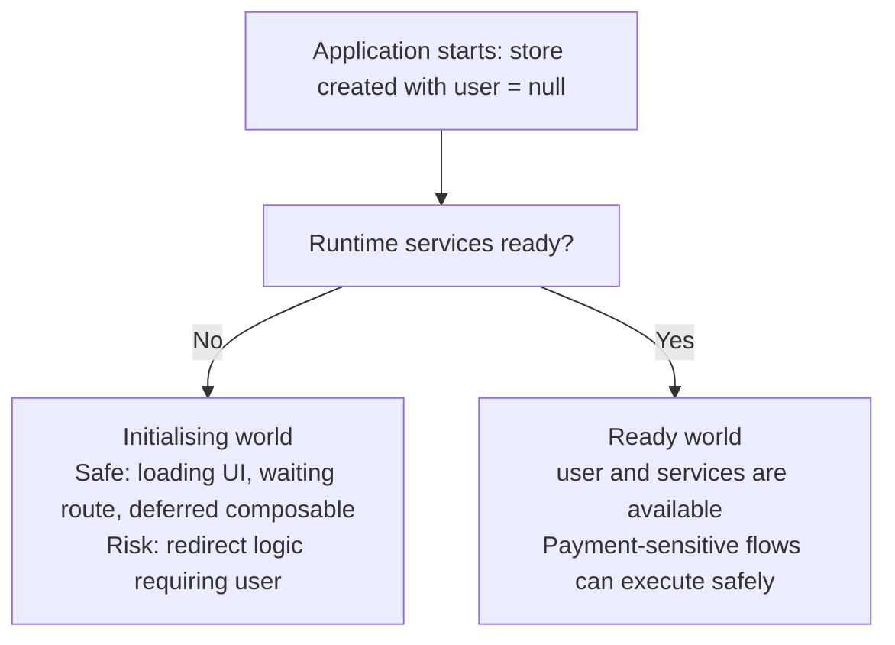

One of the most dangerous mistakes we can make with TypeScript is not a complex generic, a bad abstraction, or a poorly designed utility type.

Sometimes, the mistake is much simpler.

We describe the application as if it is already ready, while our users are still experiencing the initialising world.

That sounds abstract, but I learned this lesson in a very practical way while working on a payment journey.

We had a production issue that caused a downgrade in the customer experience during a redirect flow. This was not a theoretical bug discovered during a refactor. It was a real customer journey, in a real payment flow, where the user leaves our application, goes through a payment provider, and then comes back expecting the cashier to continue from the right place.

The concerning part was not only that the issue reached production. The concerning part was that this was exactly the kind of issue I would have expected our tests or our static analysis to catch. After all, we use TypeScript. We rely on strong types to make invalid states harder to represent. We rely on tests to protect the most important journeys. And yet, the issue slipped through because the type system was describing the application as if it was already ready, while the runtime was still going through initialisation.

That is the trap I want to talk about.

Not the trap of `null` itself. `null` is not the enemy. The trap is pretending that `null` is not part of the runtime reality when it clearly is.

In our case, the store had a `user`. Most of the application treated that `user` as something available, because under the normal startup path the application waits for the backend initialisation before allowing the main customer journey to continue. That assumption felt safe because it matched the happy path we had in our heads. The user is initialised, then the application runs, then the business logic can use the user.

The problem was that the redirect path did not follow the neat mental model we had attached to the application.

The redirect logic could execute before the relevant initialisation cycle had completed. The customer was already back in a meaningful business journey, but the store had not yet reached the ready state we assumed it had reached. From the point of view of our types, the user existed. From the point of view of the runtime, the user could still be missing.

That gap is where the bug lived.

## The false ready world

The trap often starts with a line like this:

```ts
import { ref } from 'vue';

const user = ref<User>(null as unknown as User);
```

I understand why this pattern appears in Vue and TypeScript codebases. The store starts empty, but we know it will be populated later. Components and composables across the application expect a `User`. Nobody wants to add `null` checks everywhere. Nobody wants to turn a small tactical change into a broad migration. So the store says, in effect, “trust me, this is a `User`.”

But that line does not initialise the user. It does not wait for the backend. It does not make the redirect path safer. It only asks TypeScript to stop representing one of the real states of the application.

At runtime, the first value is still `null`.

The type says `User`.

That means we now have two different realities. The customer is in the runtime reality, where the value might not exist yet. The engineer is in the TypeScript reality, where the value looks safe to use. As soon as those two realities drift apart, the type system stops being a safety net and starts becoming part of the trap.

## Initialisation and execution are not the same reality

This is where I think the distinction between initialisation and execution becomes very important.

Initialisation is the phase where the application collects the things it needs in order to operate. It may create the logger, build the adapter, load runtime settings, fetch backend session data, initialise services, and eventually populate the user.

Execution is different.

Execution is the business journey using those values: absorbing a redirect result, preparing a payment request, listening to payment status updates, or deciding what the user should see next.

Those two phases are related, but they are not the same. The mistake is to type execution code as if initialisation has already completed without making that guarantee explicit.

In a clean mental model, the application has two worlds.

There is the world before initialisation is complete. In this world, business-critical values may not exist yet. The store can be empty. The user can be `null`. Services can be missing. Runtime flags may still be unknown. This world is not wrong; it is a valid part of the application lifecycle.

Then there is the world after initialisation is complete. In this world, the required runtime contract exists. The user is available. Services are available. Runtime flags have been resolved. Payment-sensitive flows can safely depend on those values.

The issue happens when we pretend there is only one world: the ready world. We write the store as if the ready world exists from the first line of code, even though the browser, the redirect, the WebView, or the router can still put the customer inside the initialising world.

### The two realities of a dynamically initialised frontend store



This kind of bug is risky because locally, the code can feel reasonable. In the normal path, the assumption often holds. The user is initialised before most of the application needs it. The code passes review because everyone shares the same lifecycle assumption. But production is very good at finding the paths where our assumptions are incomplete.

Redirects are particularly good at exposing this because they interrupt the neat flow of the application. A customer leaves the app and comes back through a URL. Depending on the platform, browser, WebView, timing, provider behaviour, or restored state, the code that handles that return journey may run at a point where the application is not as ready as we expect.

The user does not care that the store is “about to be ready”.

The customer only experiences whether the journey continues correctly or not.

## Why static analysis missed the mismatch

This is why masking the type is so dangerous. When we write:

```ts
const user = ref<User>(null as unknown as User);
```

we remove the opportunity for TypeScript to warn us. A static analyser cannot protect us from a state we have hidden from it. It will happily allow code like this:

```ts
systemStore.user.withdrawalData?.withdrawableBalance;
```

because, according to the type system, `user` is a `User`. The fact that the runtime value started as `null` has been erased.

This is not TypeScript failing us.

This is us using TypeScript against ourselves.

The mismatch is simple:

```ts
User -> User | null
```

That difference is not cosmetic. It changes what the compiler can prove. If we hide the initialising state, then static analysis cannot tell us when execution code is crossing the boundary too early.

## Tactical improvement: make `User | null` honest

The better first step is not glamorous, but it is important. Make the raw store field honest:

```ts
import { ref } from 'vue';

const user = ref<User | null>(null);
```

This does not change the runtime behaviour. The value was already `null` before initialisation. The difference is that now TypeScript knows about it.

That small change can feel uncomfortable because it causes TypeScript to complain in places that previously looked fine. But that discomfort is useful. It shows us where execution code was depending on lifecycle knowledge that was never encoded in the type system.

In a Vue store, the assignment still remains simple:

```ts
function initialiseUser(initialisedUser: User) {
  user.value = initialisedUser;
}
```

The goal is not to make the application more complex. The goal is to stop lying about the first state of the store.

## Why nullable fields are not enough

However, making the field nullable is only the first step. If we stop there, we can easily create a different problem. Developers may start adding optional chaining everywhere:

```ts
const balance = systemStore.user?.withdrawalData?.withdrawableBalance;
```

or non-null assertions everywhere:

```ts
const balance = systemStore.user!.withdrawalData?.withdrawableBalance;
```

Both patterns have a place, but neither should become the main model for a business-critical readiness problem.

Optional chaining is correct when the business data is genuinely optional. For example, `withdrawalData` may be optional even when the user is ready. That is a real business state, and the type should allow it:

```ts
const balance = user.withdrawalData?.withdrawableBalance ?? null;
```

But optional chaining on the user itself can be a very different thing. If the payment flow requires a user, then this may avoid a crash while hiding the fact that the flow ran before the application was ready:

```ts
const userId = systemStore.user?.id;
```

That is not resilience.

That is silence.

The same is true for non-null assertions. If a component is behind a strong render boundary and the invariant is already guaranteed, `!` may be acceptable as a bridge. But if every caller has to say `systemStore.user!`, the codebase is simply moving the original lie from the store into the call sites.

The deeper fix is to model the boundary, not just the field.

## Setting boundaries with a discriminated union

In our case, the user was not really an isolated value. It belonged to a group of runtime-services values that became meaningful together:

- the user;
- the backend services;
- whether debug mode was enabled;
- whether the customer was returning to the cashier.

Those values formed a contract. Either that contract was still pending, or it was ready.

That shape is a perfect fit for a discriminated union:

```ts
type RuntimeServicesState =
  | {
      status: 'pending';
      user: null;
      services: null;
      isDebugEnabled: null;
      isReturningToCashier: null;
    }
  | {
      status: 'ready';
      user: User;
      services: Services;
      isDebugEnabled: boolean;
      isReturningToCashier: boolean;
    };
```

This is the point where TypeScript starts helping again.

Instead of pretending the user is always available, we describe the two realities explicitly. In the pending world, the values are not available. In the ready world, they are available together. The `status` field becomes the boundary between those worlds.

Now a consumer that can handle the initialising state can branch safely:

```ts
const runtimeServices = systemStore.runtimeServicesState;

if (runtimeServices.status !== 'ready') {
  return;
}

runtimeServices.user;
runtimeServices.services;
```

Inside the `ready` branch, TypeScript knows that `user` is a `User` and `services` is `Services`. Not because we forced the compiler to believe it, but because the type has proven it.

That is a very different kind of confidence.

## Deriving readiness from Vue store fields

It also matters that this grouped state should be derived from the raw fields, not manually duplicated. The raw Vue store state can remain honest:

```ts
import { computed, ref } from 'vue';

const user = ref<User | null>(null);
const services = ref<Services | null>(null);
const isDebugEnabled = ref<boolean | null>(null);
const isReturningToCashier = ref<boolean | null>(null);
```

Then the readiness state can be computed from those values:

```ts
const runtimeServicesState = computed<RuntimeServicesState>(() => {
  if (
    !user.value ||
    !services.value ||
    isDebugEnabled.value === null ||
    isReturningToCashier.value === null
  ) {
    return {
      status: 'pending',
      user: null,
      services: null,
      isDebugEnabled: null,
      isReturningToCashier: null,
    };
  }

  return {
    status: 'ready',
    user: user.value,
    services: services.value,
    isDebugEnabled: isDebugEnabled.value,
    isReturningToCashier: isReturningToCashier.value,
  };
});
```

The store still has one source of truth. The discriminated union is a typed view of that truth. It gives engineers a safe way to understand the lifecycle without asking every reader to remember the exact initialisation order.

The assignment point can remain direct and tactical:

```ts
function initialiseRuntimeServices(props: RuntimeServicesProps) {
  user.value = props.user;
  services.value = props.services;
  isDebugEnabled.value = props.isDebugEnabled;
  isReturningToCashier.value = props.isReturningToCashier;
}
```

This is why the approach is useful in an existing Vue application. It does not require a full rewrite before it starts improving the type model. It makes the current lifecycle visible, then gives engineers a safer way to consume it.

## When pending is valid, and when pending is a bug

For flows where pending is a valid state, branching on the union is the right tool. A component can show loading. A route can wait. A composable can return a pending result. The code is saying, clearly, “this part of the application knows both worlds exist.”

A Vue component can make that boundary visible without pretending the user exists too early:

```vue
<script setup lang="ts">
import { computed } from 'vue';

const systemStore = useSystemStore();

const runtimeServices = computed(() => systemStore.runtimeServicesState);
</script>

<template>
  <LoadingState v-if="runtimeServices.status === 'pending'" />

  <CashierView
    v-else
    :user="runtimeServices.user"
    :services="runtimeServices.services"
  />
</template>
```

But some flows should not run in the pending world. A redirect absorption flow that requires the user and backend services is not a loading screen. If it runs without those values, the flow itself is invalid.

In that case, repeating readiness checks everywhere can become noisy. I prefer a central accessor:

```ts
type ReadyRuntimeServicesState = Extract<
  RuntimeServicesState,
  { status: 'ready' }
>;

function requireRuntimeServices(): ReadyRuntimeServicesState {
  const state = runtimeServicesState.value;

  if (state.status !== 'ready') {
    throw new Error('Runtime services used before initialisation');
  }

  return state;
}
```

Then the execution code can be written against the ready contract:

```ts
const { user, services } = systemStore.requireRuntimeServices();

absorbRedirectPaymentResult({
  user,
  services,
  redirectParams,
});
```

This does not make the pending state disappear. It makes the requirement explicit. It says that this flow belongs to the ready world, and if it is called before that world exists, we want a clear failure that points to the real lifecycle problem.

That is far better than a random `Cannot read properties of null`, and much better than silently swallowing the problem with optional chaining.

## Recommendation: separate initialisation state from execution state

There is also a stronger architectural direction behind this idea. In a larger system, we can separate the temporary initialisation state from the final execution context. The initialisation state is allowed to be incomplete because its job is to assemble the runtime. The execution context should be complete because its job is to serve the customer journey.

The before-initialisation state can be honest about missing values:

```ts
type CashierInitialisationState = {
  logger: Logger | null;
  settings: Settings | null;
  user: User | null;
  services: Services | null;
};
```

This type belongs to the initialising world. It says that the application is still collecting what it needs.

The final runtime should look different:

```ts
type InitialisedCashierRuntime = {
  logger: Logger;
  settings: Settings;
  user: User;
  services: Services;
};
```

That type belongs to the ready world. Business flows should prefer this world whenever possible.

The long-term version of this approach is an explicit initialisation pipeline:

```ts
async function initialiseCashierRuntime(): Promise<InitialisedCashierRuntime> {
  const logger = createLogger();
  const settings = await loadSettings();
  const user = await loadUser();
  const services = await loadServices();

  return {
    logger,
    settings,
    user,
    services,
  };
}
```

Only once this promise resolves should the application expose the fully initialised runtime to the parts of the code that require it.

This does not mean every application needs to jump immediately to a full initialisation pipeline. In a real codebase, the tactical path is usually smaller:

- remove the misleading cast;
- make the raw field honest;
- derive a discriminated union;
- add a central accessor;
- migrate the highest-risk flows first.

That is enough to change the direction of the codebase.

## What this teaches us as engineers

The important lesson is not that `null` is bad. It is not that optional chaining is bad. It is not that non-null assertions are always forbidden. The lesson is that the type system should describe the world your code can actually run in.

A practical way to think about it is this:

- If a value is missing before initialisation, represent that in the type.
- If a group of values becomes available together, model that group as a readiness boundary.
- If a flow can run while the application is pending, branch on that state.
- If a flow requires the ready world, make that requirement explicit.
- If the code is business-critical, do not rely on hidden lifecycle knowledge.

The mistake is to use types to describe the world we hope the application is in, rather than the world the customer may actually be experiencing.

This matters even more in payment journeys because the technical detail becomes a trust problem. A customer returning from a payment provider is not thinking about lifecycle phases, store hydration, or TypeScript casts. They are thinking about whether the payment worked, whether their money is safe, and whether the experience can be trusted.

If our types hide the initialising world, the customer may be the first person to discover that the ready world did not exist yet.

That is not the kind of feedback loop we want.

## Final thought

The next time you see a Vue store field initialised like this:

```ts
const user = ref<User>(null as unknown as User);
```

pause for a moment.

Ask what reality the type is describing. Ask what reality the runtime can guarantee. Ask whether a redirect, reload, WebView restore, route transition, or startup-sensitive flow can reach that code before the store is ready.

The solution described here is one concrete response to one concrete production experience. It is not the only valid design. Another team might choose a stronger render boundary, a result type, an explicit bootstrap pipeline, or a different store shape. Those alternatives can all be valid depending on the system.

The essence remains the same: model the boundaries of the customer reality instead of masking that reality based on the current state of the code.

Code is a living organism. It changes over time. A model that feels safe today can become misleading tomorrow when the product grows, the journey changes, or another integration path appears. That is how a simple addition, such as monitoring an extra analytics field, can become a production issue affecting customer trust.

Honest modelling protects more than the type system. It protects the codebase from hidden assumptions, and it protects the customer experience from discovering those assumptions too late.

Use the type system to separate initialisation from execution. Let TypeScript work against the unsafe assumption before production does.

That is where reliable frontend architecture begins.
